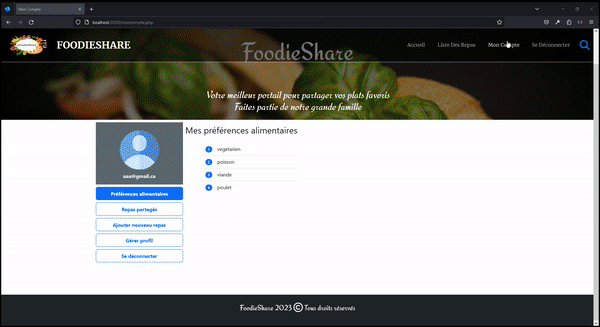

# FoodieShare_PHP_App
FoodieShare is a student meal exchange platform. It is developed with PHP, HTML, CSS and JSON technologies.

## FoodieShare Description
FoodieShare is a web application for students that allows them to discover and share
Meals available on campus or nearby. The application allows users to consult a list of available meals, 
give their opinion on each dish and share photos of their meals favorites.
This project will allow students to share their culinary experiences and discover new dishes and make 
informed decisions when choosing where to eat on or near campus.

## Technologies used

### PHP: 
The project is developed using the PHP programming language for data processing and business logic.

### HTML/CSS: 
The user interface is created using HTML and CSS to provide a visual experience pleasant.

### JSON: 
A JSON database is used to store meal information, guest reviews, users and photos.

## Features

### Meal display:
The app displays a list of available meals with details such as dish name, description, price and location. 
It also allows you to display details of a single meal.

### User reviews:
Users can give their opinion on each dish by giving a rating and leaving a comment. 
Reviews are displayed to allow other users to make an informed decision.

### Photo sharing:
Users can upload photos of their favorite meals to share with the community. 
Photos are displayed with details of the corresponding dish.

### Search and filtering:
Users can search by dish name or keywords to find specific meals. 
They can also filter results based on criteria such as price or location.

### User profiles:
Users can create an account, log in and manage their profile. 
They can indicate their food preferences, share information about their 
favorite meals and interact with other users by leaving comments on their dishes.

### Meal database:
Information about available meals, including details, user reviews, and photos, is stored in a JSON database.

## Demonstration

### View meal list

### Meal search and filter

### User profile : register

### User profile : log in

### User profile : View/Add/Delete dish

### User profile : update profile/log out

### Add a rating and comment to a dish

## Contribute

If you would like to contribute to this project, please follow these steps:

   Fork the project
   
   Create a new branch (git checkout -b feature/new-feature)
   
   Make changes and add features
   
   Commit changes (git commit -am 'Add new feature')
   
   Push changes to the branch (git push origin feature/new-feature)
   
   Create a new Pull Request 

## Author 

Fatima Boumhamdi - @FatimaBoumhamdi 

## License 

This project is licensed under the MIT License - see the LICENSE file for details.
